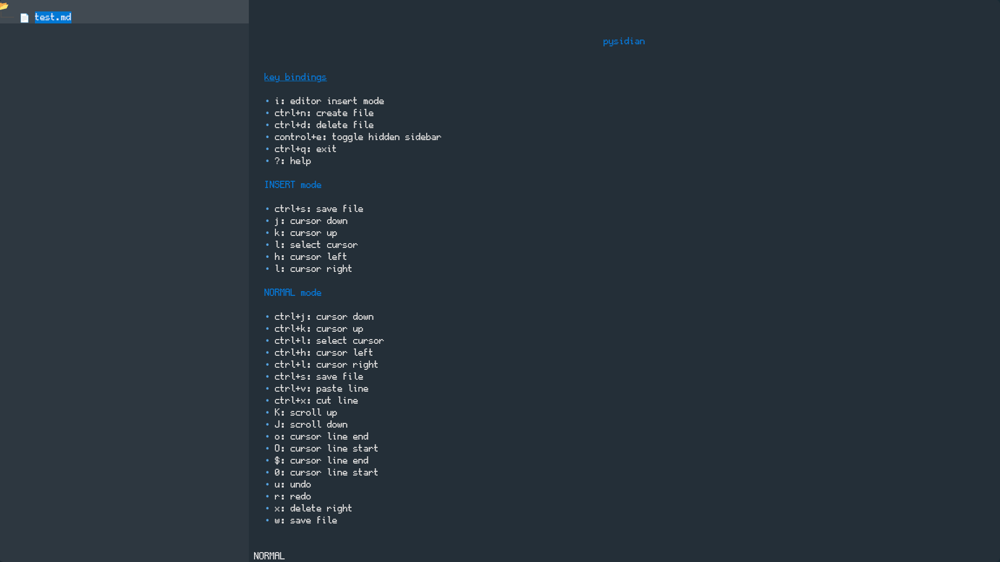
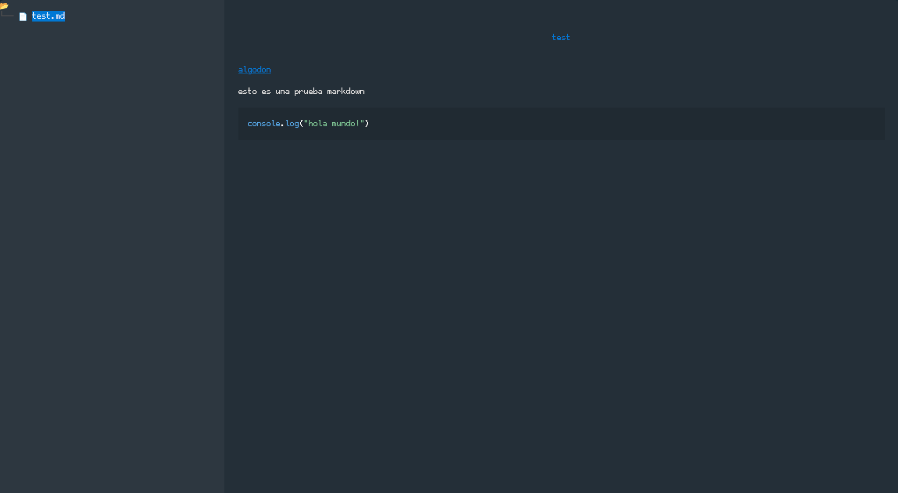
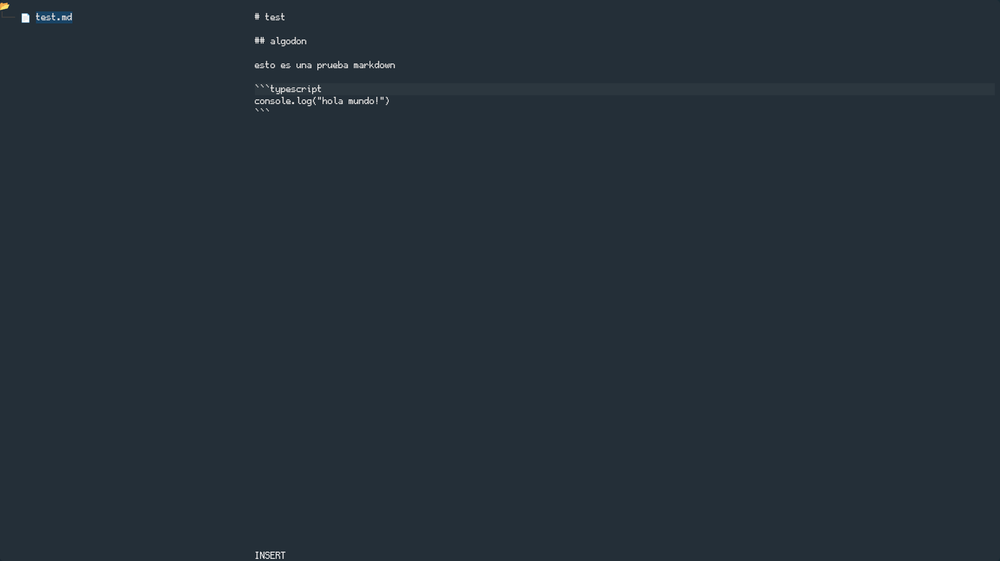

# pysidian





## Descripción

pysidian es una interfaz de usuario textual (TUI) para la terminal que permite editar y visualizar archivos Markdown de manera eficiente. Inspirado en la experiencia de usuario de Obsidian, ofrece funcionalidades para gestionar notas y documentos Markdown desde la línea de comandos, integrando visualización y edición en un entorno amigable para usuarios que prefieren trabajar en terminal. Esta herramienta facilita un flujo de trabajo ágil para quienes desean un manejo rápido y concentrado de sus archivos Markdown sin salir del entorno de la terminal.

## Funcionalidades

- Código completamente en Python.
- Proyecto en versión inicial (0.0.1).
- edicion y previsualizacion de archivos markdown

## Instalación

1. Clonar el repositorio

```bash
git clone https://github.com/KrashMello/pysidian.git
```

2. Navegar al directorio del proyecto

```bash
cd pysidian
```

3. Crear un entorno virtual (recomendado para aislar dependencias):

Linux/Mac:

```bash
python3 -m venv venv
```

Windows:

```bash
python -m venv venv
```

4. Activar el entorno virtual:

Linux/Mac:

```bash
source venv/bin/activate
```

Windows

```bash
venv\Scripts\activate
```

5. Instalar las dependencias desde el archivo requirements.txt:

```bash
pip install -r requirements.txt
```

## Uso

```bash
python3 pysidian.py
```

## Estado del Proyecto

🚧 Proyecto en desarrollo 🚧
La versión actual es la 0.0.1 y puede encontrarse en fase inicial sin funcionalidades completas.

## Tecnologías

- Python 100%

## Contribuciones

Las contribuciones son bienvenidas. Se recomienda enviar pull requests con mejoras, correcciones o nuevas funcionalidades.
